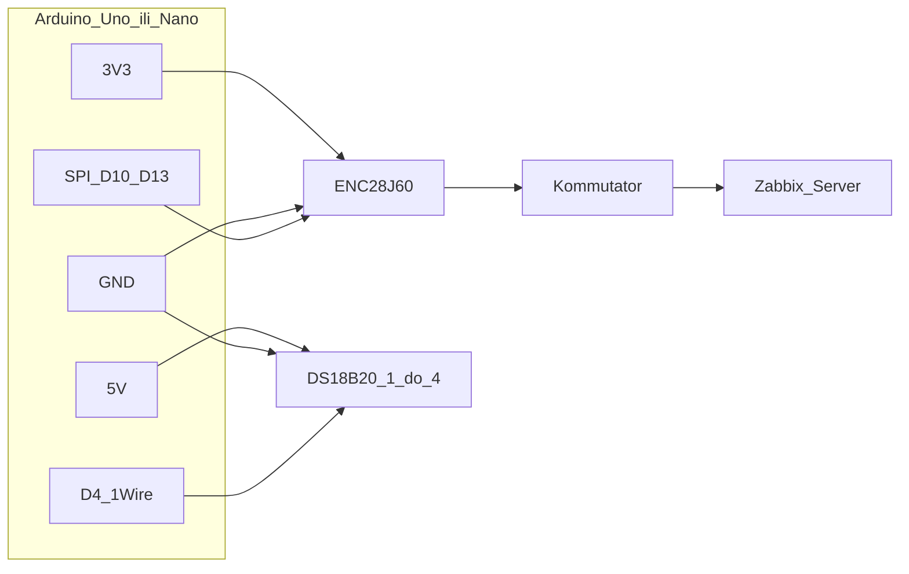
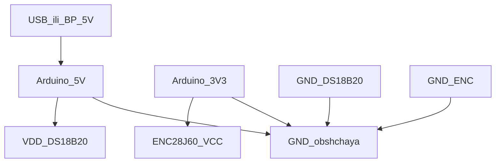
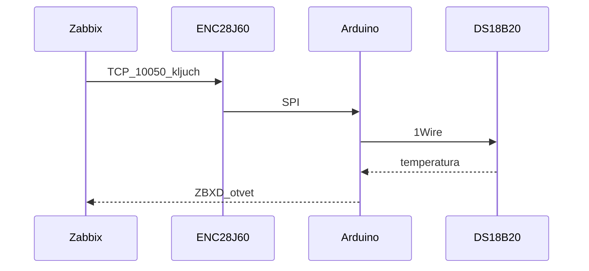

# Схемы и соединения (обзор)

Связка документов: [OBSHIY_BOM.md](OBSHIY_BOM.md) (список железа), [MONTAZH_ENC28J60.md](MONTAZH_ENC28J60.md) (Ethernet), [MONTAZH_I_PAYKA_DS18B20.md](MONTAZH_I_PAYKA_DS18B20.md) (датчики).

---

## 1. Блок-схема узла



---

## 2. Питание (логика)



*Если просадка 3.3 В — см. [MONTAZH_ENC28J60.md](MONTAZH_ENC28J60.md).*

---

## 3. Один DS18B20 — соединения (ASCII)

```
        Arduino Uno/Nano
        +-----+
  5V ---|5V   |
        |     |
        | D4  |--------------------+------- DQ (вывод 2 DS18B20)
        |     |                    |
        |     |                    R 4k7
        |     |                    |
  GND---|GND  |                    +------- к 5V (подтяжка)
        |     |
        +-----+

  DS18B20 TO-92 (лицом к себе, ножки вниз):
  [1 GND] [2 DQ] [3 VDD]
     |       |       |
    GND      |       +--- 5V
             |
             +----------- к линии DQ / D4 / резистору (как выше)
```

---

## 4. Несколько DS18B20 на одной шине

```
  5V ------+---- VDD датчик A
           +---- VDD датчик B
           +---- VDD датчик C
           |
           +----[ 4k7 ]----+---- общая шина DQ ---- D4 Arduino
                           |
            DQ_A ----------+
            DQ_B ----------+
            DQ_C ----------+

  GND ------+---- GND A, GND B, GND C
```

Один резистор **4.7 kΩ** на **всю** шину **DQ**.

---

## 5. ENC28J60 и Arduino (краткая таблица)

| Модуль ENC28J60 | Arduino Uno / Nano |
|-----------------|-------------------|
| VCC (3.3 В) | **3.3V** |
| GND | **GND** |
| CS | **D10** |
| SO | **D12** (MISO) |
| SI | **D11** (MOSI) |
| SCK | **D13** |

На бутерброд-шилде (NANO Ethernet Shield V1.C) все пины подключаются автоматически через гребёнки. **Внимание:** пин RST на гребёнке шилда — это сброс **самого Arduino**, а не ENC28J60. Не подключайте к нему GPIO-пины.

Подробности и предупреждения: [MONTAZH_ENC28J60.md](MONTAZH_ENC28J60.md).

---

## 6. Сеть 10.10.0.0/23

- Маска **255.255.254.0**, допустимые хосты для устройств: **10.10.0.30–10.10.1.254** (как в вашей политике).
- В скетче: `ip`, `gateway`, `subnet`, уникальный `mac[]` на каждую плату.

---

## 7. Поток данных к Zabbix


